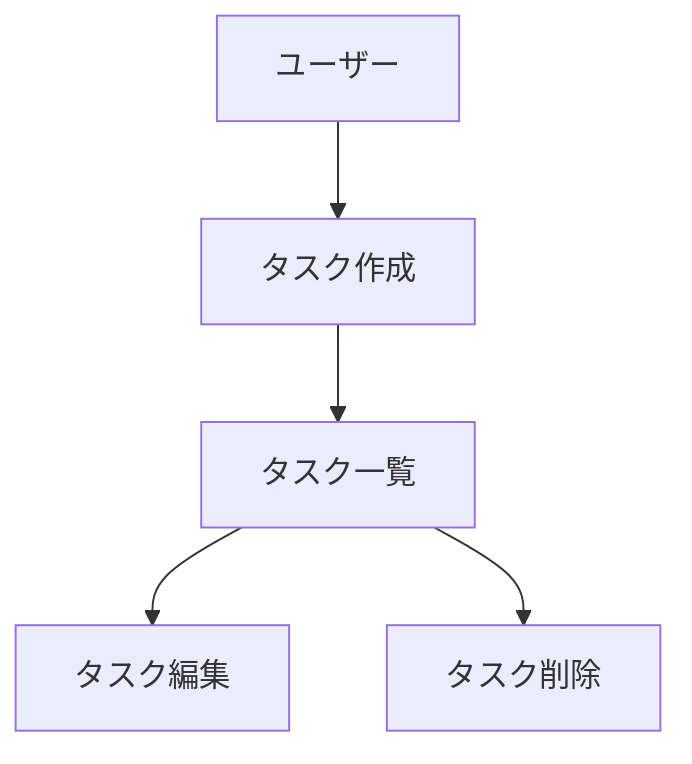

> **必ず参照**: 作業を進める際は、本プロジェクトの起点となる要求メモ [`docs/ideas/initial-requirements.md`](docs/ideas/initial-requirements.md) を常に参照すること。プロダクトの目的・成果物・確定した技術スタックが記載されている。
> **CLAUDE.md への反映**: 初回セットアップ時に CLAUDE.md を作成（既存なら追記）する。記載するのは「ステアリング規則の要約」と「プロジェクト固有情報」のみで、**本ファイルの全文を書き写さない**（CLAUDE.md は毎セッション読み込まれるため、詳細ルールのコピーはコンテキストの浪費と規則の乖離を招く）。詳細は「初回セットアップ時の手順」の該当ステップを参照。

# ドキュメント駆動開発プロセス

開発を進める上で順守すべき標準ルールを定義する。このコマンドが呼ばれたら、以下のルールに従ってドキュメント整備・開発を進める。

引数: `$ARGUMENTS`

- **引数なし** → 本ファイルのルールを読み込んで以降の作業に適用するのみ。**ファイルの作成・変更は行わない。** 現在のプロジェクト状態（`docs/` や `.steering/` の有無）を簡潔に報告し、未整備なら `/dev-docs init` を、機能追加なら `/add-feature` を案内する
- `init` → 「初回セットアップ時の手順」を実行
- `<YYYYMMDD>-<開発タイトル>`（例: `20250115-add-tag-feature`）→ 「機能追加・修正時の手順」を実行し、そのステアリングディレクトリを作成

## プロジェクト構造

本リポジトリでは、開発を「永続的ドキュメント」と「作業単位のドキュメント」の2層で管理する。

### ドキュメントの分類

#### 1. 永続的ドキュメント(`docs/`)

アプリケーション全体の「**何を作るか**」「**どう作るか**」を定義する恒久的なドキュメント。
アプリケーションの基本設計や方針が変わらない限り更新されません。

- **product-requirements.md** - プロダクト要求定義書
  - プロダクトビジョンと目的
  - ターゲットユーザーと課題・ニーズ
  - 主要な機能の定義
  - 成功の定義
  - ビジネス要件
  - ユーザーストーリー
  - 受け入れ条件
  - 機能要件
  - 非機能要件
- **functional-design.md** - 機能設計書
  - 機能ごとのアーキテクチャ
  - システム構成図
  - データモデル定義(ER図含む)
  - コンポーネント設計
  - ユースケース図、画面遷移図、ワイヤーフレーム
  - API設計(将来的にバックエンドと連携する場合)
  - ドメイン（境界づけられたコンテキスト）分割と、各レイヤー／モジュールの責務（単一責任）・依存方向、ポート（interface）の定義場所・実装場所（「アーキテクチャ原則」を参照）
- **architecture.md** - 技術仕様書
  - テクノロジースタック
  - 開発ツールと手法
  - 技術的制約と要件
  - パフォーマンス要件
  - アーキテクチャ原則（単一責任・一方向依存・疎結合・依存性逆転）と、それを担保する技術方針（「アーキテクチャ原則」を参照）
- **repository-structure.md** - リポジトリ構造定義書
  - フォルダ・ファイル構成（ドメイン駆動 × レイヤードの場合、`src/modules/<domain>/{domain,application,infrastructure,presentation}` + `src/shared/`）
  - ディレクトリの役割
  - ファイル配置ルール（ドメイン分割・ドメイン間の結合ルール含む）
  - 依存方向のルールと、ポート定義層／実装層の配置（依存性逆転の担保。「アーキテクチャ原則」を参照）
- **development-guidelines.md** - 開発ガイドライン
  - コーディング規約
  - 命名規則
  - スタイリング規約
  - テスト規約
  - Git規約
  - 依存方向・依存性逆転・SDK 型の境界越え禁止など、アーキテクチャ原則を守る運用規約（「アーキテクチャ原則」を参照）
- **glossary.md** - ユビキタス言語定義
  - ドメイン用語の定義
  - ビジネス用語の定義
  - UI/UX用語の定義
  - 英語・日本語対応表
  - コード上の命名規則
- **development-roadmap.md** - 開発工程
  - 開発ステップの明記

#### 2. 作業単位のドキュメント(`.steering/[YYYYMMDD]-[開発タイトル]/`)

特定の開発作業における「**今回何をするか**」を定義する一時的なステアリングファイル。
作業完了後は参照用として保持されますが、新しい作業では新しいディレクトリを作成します。

- **requirements.md** - 今回の作業の要求内容
  - 変更・追加する機能の説明
  - ユーザーストーリー
  - 受け入れ条件
  - 制約事項
- **design.md** - 変更内容の設計
  - 実装アプローチ
  - 変更するコンポーネント
  - データ構造の変更
  - 影響範囲の分析
- **tasklist.md** - タスクリスト
  - 具体的な実装タスク
  - タスクの進捗状況
  - 完了条件

### ステアリングディレクトリの命名規則

```
.steering/[YYYYMMDD]-[開発タイトル]/
```

**例:**

- `.steering/20250103-initial-implementation/`
- `.steering/20250115-add-tag-feature/`
- `.steering/20250120-fix-filter-bug/`
- `.steering/20250201-improve-performance/`

## サブエージェント運用方針（全コマンド共通）

ドキュメント駆動開発では、実装に入る前に大量の原文（`docs/` 7ファイル、仕様、既存コード）を読む必要がある。これを**すべてメインコンテキストで読むと、一番コンテキストが必要な実装フェーズで枯渇する**。したがって次を全コマンド共通のルールとする。

### 委譲するもの（隔離コンテキストのサブエージェントに肩代わりさせる）

原文が重く、**メインには結論だけあればよい**作業:

- 永続的ドキュメント（`docs/` 7ファイル）・`CLAUDE.md` の読み込み → `docs-digest`（実装前提ダイジェストを返す）
- ドキュメントのレビュー → `review-docs`（指摘リストだけを返す）
- 永続的ドキュメントの生成・更新 → `doc-writer`（1ファイルずつ。書いたパスと要約だけを返す）
- 外部仕様（FieldSpec OS MCP）の取得 → `fsos-spec-fetcher`（キャッシュに逃がし、索引だけを返す）
- コードベースの影響範囲調査・既存パターンの探索 → 組み込みの `Explore`
- アプリの動作検証（サーバログ・ブラウザ操作など出力が冗長なもの）→ 組み込みの `general-purpose`
- テストの作成・実行 → プロジェクトに `test-writer` エージェントがあればそれ
- 実装差分のレビュー → プロジェクトに `code-reviewer` エージェントがあればそれ

### メインに残すもの（委譲しない）

- **ユーザーとの対話・承認ゲート** — サブエージェントはユーザーに質問できない
- **実装本体** — 文脈の連続性が必要で、細切れに委譲すると整合性が崩れる
- **git / gh などの不可逆操作**（commit / push / PR 作成 / マージ / Issue 起票）— 判断を伴い、取り返しがつかない

### 委譲先の使い分け

| 種類 | 使うもの | 判断基準 |
| --- | --- | --- |
| 決まった形式で返す契約が必要 | 専用エージェント（`~/.claude/agents/`） | 出力を後続ステップが機械的に使う |
| 汎用的な探索・調査 | 組み込み `Explore` | 「どこにあるか」を知りたいだけ |
| 実行と検証 | 組み込み `general-purpose` | コマンド実行が必要で出力が冗長 |

### 守ること

- **委譲した対象の原文を、メインで読み直さない。** 読み直したら委譲の意味が消える。必要になったら、返ってきた出典ポインタ（`ファイル > セクション`）を頼りに該当箇所だけを `Read` する。
- サブエージェントには**返してほしい形式を明示**する。曖昧に投げると原文が返ってきてコンテキストを食う。
- 承認ゲートは必ずメインで取る。サブエージェントに承認を代行させない。

## 開発プロセス

### 初回セットアップ時の手順

#### 0. 既存ドキュメントの確認（上書き防止）

セットアップを始める前に、必ず現状を確認する:

- `docs/` に永続的ドキュメント（下記7ファイルのいずれか）が**すでに存在する場合は、いきなり作成・上書きしない**。既存ファイルを列挙して現状を要約し、「不足ファイルのみ作成 / 作り直し / 中止」をユーザーに確認してから進める。
- `docs/ideas/initial-requirements.md`（真の情報源）が存在しない場合は、先に `/init-idea` で作成することを提案する。ユーザーが不要と判断した場合のみ、ヒアリングしながらセットアップを続行してよい。

#### 1. フォルダ作成

```bash
mkdir -p docs
mkdir -p .steering
```

#### 1.5. リポジトリ実態の調査（`Explore` に委譲）

生成する docs は「**何を作るか**（＝初期要求メモ）」と「**どう作るか**（＝このリポジトリの実態）」の両方を反映する。後者を、組み込みの `Explore` サブエージェントに調べさせる。**メインでディレクトリを舐めない。**

返させる内容を明示して依頼する:

- 言語・フレームワーク・主要ライブラリと**バージョン**（マニフェストの実値）
- build / 開発サーバ / lint / 型チェック / テスト / フォーマットの**実コマンド**（`package.json` の `scripts`、`pyproject.toml` 等から。存在しないものは「なし」と明記させる）
- ディレクトリ構成の要約（深さ2〜3）
- 既存の `docs/` `CLAUDE.md` `README.md` の有無
- Lint / フォーマッタ / テストランナーの設定ファイルの有無

空のリポジトリなら「未構成」と返させ、初期要求メモ＋本ファイルの推奨構成から初期構成を提案する。

#### 2. 永続的ドキュメント作成(`docs/`)

アプリケーション全体の設計を定義します。
各ドキュメントを作成後、必ず確認・承認を得てから次に進みます。

1. `docs/product-requirements.md` - プロダクト要求定義書
2. `docs/functional-design.md` - 機能設計書
3. `docs/architecture.md` - 技術仕様書
4. `docs/repository-structure.md` - リポジトリ構造定義書
5. `docs/development-guidelines.md` - 開発ガイドライン
6. `docs/glossary.md` - ユビキタス言語定義
7. `docs/development-roadmap.md` - 開発工程

**各ファイルの執筆は `doc-writer` サブエージェントに委譲する。** 起動のたびに次を渡す:

- 生成対象ファイルのパス
- 情報源: `docs/ideas/initial-requirements.md` のパス
- 手順 1.5 で得たリポジトリ実態サマリ
- **既に確定した先行ドキュメントの決定事項**（`doc-writer` が返す「次のファイルへの引き継ぎ事項」をそのまま次に渡す）

**重要:**

- **1ファイルごとに作成後、必ず確認・承認を得てから次のファイル作成を行う。** 承認はメインが取る（`doc-writer` に代行させない）。`doc-writer` が返した要約とファイルパスを提示し、ユーザーには実ファイルを確認してもらう。
- **7ファイルを並列生成しない。** 上の順に逐次実行する。後続ドキュメントは先行の決定事項（技術選定・レイヤー構成・命名規則）に従う必要があり、並列にすると整合性が壊れる。
- `doc-writer` が「矛盾の検知」を返したら、次に進む前にユーザーに提示して解消する。

#### 3. CLAUDE.md の作成・更新

CLAUDE.md を作成する（既存なら該当セクションを追記・更新する）。記載する内容は次に**限定**する:

1. **ステアリング規則の要約**: `.steering/[YYYYMMDD]-[開発タイトル]/` に `requirements.md` / `design.md` / `tasklist.md` の3ファイルを作成すること、およびディレクトリ命名規則
2. **プロジェクト固有情報**: 確定した技術スタック、ビルド・テスト・lint の実行コマンド、仮想環境の有効化方法など
3. **プロセスへの参照**: 「開発プロセスの詳細ルール（ドキュメント構成・承認手順・図表規約など）は `/dev-docs` に従う」という1行

本ファイル（dev-docs）の全文や詳細ルールを CLAUDE.md に書き写さないこと。

`doc-writer` に委譲してよい。その場合は「記載内容を上記3項目に限定する」制約を明示的に渡すこと。

#### 3.5. ドキュメント横断レビュー（必須）

**7ファイル + `CLAUDE.md` が揃った時点で、`/review-docs` を必ず実行する。**

手順 2 は 1ファイルずつ逐次生成するため、各ファイル単体では整合していても**ドキュメント間の不整合**（技術スタックの食い違い、要求 → 設計のトレーサビリティ欠如、用語の表記ゆれ、`repository-structure.md` と実構成の乖離）が残りうる。それを検出する手段はここしかないので、スキップしない。

- `review-docs` サブエージェントが返す指摘リストをユーザーに提示する。
- **Critical は実装に入る前に必ず修正する**（誤った設計の上に実装すると手戻りが大きい）。Major はユーザーと相談して要否を判断する。
- 修正は `doc-writer` に該当ファイルを渡して行い、修正後にもう一度 `/review-docs` をかける。

#### 4. 初回実装用のステアリングファイル作成

初回実装用のディレクトリを作成し、実装に必要なドキュメントを配置します。
日付は実行時に取得します（プレースホルダをそのままディレクトリ名にしない）。

```bash
DATE=$(date +%Y%m%d)
mkdir -p ".steering/${DATE}-initial-implementation"
```

作成するドキュメント:

1. `.steering/[YYYYMMDD]-initial-implementation/requirements.md` - 初回実装の要求
2. `.steering/[YYYYMMDD]-initial-implementation/design.md` - 実装設計
3. `.steering/[YYYYMMDD]-initial-implementation/tasklist.md` - 実装タスク

#### 5. 環境セットアップ

#### 6. 実装開始

`.steering/[YYYYMMDD]-initial-implementation/tasklist.md` に基づいて実装を進めます。

#### 7. 品質チェック

- Lint・型チェック・関連テストを実施する。
- 「アーキテクチャ原則」（単一責任・一方向依存・疎結合・依存性逆転）に照らし、ドキュメントとコードが原則を満たしているか確認する。

### 機能追加・修正時の手順

> Issue 起票から PR・main マージまで自動で回したい場合は `/add-feature` を使う。以下はその土台となる手順。

#### 0. コンテキストの取得（`docs-digest` に委譲）

実装の前提（技術スタック・実行コマンド・Git 規約・命名規則・配置ルール・テスト規約）は、`docs-digest` サブエージェントに取得させる。**メインで `docs/` の原文を読み込まない。**

#### 1. 影響分析

- 既存コードへの影響範囲（変更/追加するモジュール・関数・データ構造）の洗い出しは、組み込みの `Explore` サブエージェントに委譲する。返させるのは「変更が必要なファイルと `file:line`」「踏襲すべき既存パターン」「再利用できる既存の関数・ユーティリティ」だけ。
- 永続的ドキュメント(`docs/`)への影響を確認
- 変更が基本設計に影響する場合は `docs/` を更新

#### 2. ステアリングディレクトリ作成

新しい作業用のディレクトリを作成します。日付は実行時に取得します（プレースホルダをそのままディレクトリ名にしない）。

```bash
DATE=$(date +%Y%m%d)
mkdir -p ".steering/${DATE}-<開発タイトル>"
```

**例:**

```bash
mkdir -p .steering/20250115-add-tag-feature
```

#### 3. 作業ドキュメント作成

作業単位のドキュメントを作成します。
各ドキュメント作成後、必ず確認・承認を得てから次に進みます。

1. `.steering/[YYYYMMDD]-[開発タイトル]/requirements.md` - 要求内容
2. `.steering/[YYYYMMDD]-[開発タイトル]/design.md` - 設計
3. `.steering/[YYYYMMDD]-[開発タイトル]/tasklist.md` - タスクリスト

**重要:** 1ファイルごとに作成後、必ず確認・承認を得てから次のファイル作成を行う。
**例外:** `/add-feature` 経由で実行する場合は、3ファイルを一括作成し、実装前の承認ゲート1回にまとめてよい（承認の粒度は add-feature 側の手順を優先する）。

#### 4. 永続的ドキュメント更新(必要な場合のみ)

変更が基本設計に影響する場合、該当する `docs/` 内のドキュメントを更新します。

#### 5. 実装開始

`.steering/[YYYYMMDD]-[開発タイトル]/tasklist.md` に基づいて実装を進めます。

#### 6. 品質チェック

- Lint・型チェック・関連テストを実施する。
- 「アーキテクチャ原則」（単一責任・一方向依存・疎結合・依存性逆転）に照らし、ドキュメントとコードが原則を満たしているか確認する。

## ドキュメント管理の原則

### 永続的ドキュメント(`docs/`)

- アプリケーションの基本設計を記述
- 頻繁に更新されない
- 大きな設計変更時のみ更新
- プロジェクト全体の「北極星」として機能

### 作業単位のドキュメント(`.steering/`)

- 特定の作業・変更に特化
- 作業ごとに新しいディレクトリを作成
- 作業完了後は履歴として保持
- 変更の意図と経緯を記録

### 図表・ダイアグラムの記載ルール

設計図やダイアグラムは、関連する永続的ドキュメント内に直接記載し、手間を最小限に抑えます。
独立したdiagramsフォルダは作成しません。

**配置例:**

- ER図、データモデル図 → `functional-design.md` 内に記載
- ユースケース図 → `functional-design.md` または `product-requirements.md` 内に記載
- 画面遷移図、ワイヤーフレーム → `functional-design.md` 内に記載
- システム構成図 → `functional-design.md` または `architecture.md` 内に記載

### 記述形式

1. **Mermaid記法(推奨)**
  - Markdownに直接埋め込める
  - バージョン管理が容易
  - ツール不要で編集可能



2. **ASCIIアート**
  - シンプルな図表に使用
  - テキストエディタで編集可能

```
┌─────────┐
│ Header  │
└─────────┘
     │
     ↓
┌─────────┐
│Task List│
└─────────┘
```

3. **画像ファイル(必要な場合のみ)**
  - 複雑なワイヤーフレームやモックアップ
  - `docs/images/` フォルダに配置
  - PNG または SVG 形式を推奨

### 図表の更新

- 設計変更時は対応する図表も同時に更新
- 図表とコードの乖離を防ぐ

### 注意事項

- ドキュメントの作成・更新は段階的に行い、各段階で承認を得る
- **`docs/` の原文をメインコンテキストに読み込まない**（「サブエージェント運用方針」参照）。読み込み・生成・レビューはサブエージェントに委譲し、メインは要約と出典ポインタだけを持つ
- `.steering/` のディレクトリ名は日付と開発タイトルで明確に識別できるようにする
- 永続的ドキュメントと作業単位のドキュメントを混同しない
- コード変更後は必ずリント・型チェックを実施する
- 共通のデザインシステムを使用して統一感を保つ
- セキュリティを考慮したコーディング(XSS対策、入力バリデーションなど)
- 図表は必要最小限に留め、メンテナンスコストを抑える
- アーキテクチャは「アーキテクチャ原則」（単一責任・一方向依存・疎結合・依存性逆転）を満たすこと。設計ドキュメントで各原則を担保する

## アーキテクチャ原則（設計ドキュメントで必ず担保する）

永続的ドキュメント（特に `architecture.md` / `functional-design.md` / `repository-structure.md` / `development-guidelines.md`）を作成・更新する際、および実装・レビュー時には、以下の設計原則が**文書上で担保されているか**を必ずチェックする。単に「レイヤードアーキテクチャを採用する」と書くだけでは不十分で、各原則を満たす具体的な記述（責務・依存方向・ポート定義場所・変換規約）まで落とし込むこと。

> **推奨構成: ドメイン駆動 × レイヤード（モジュラモノリス）**
> ドメイン（境界づけられたコンテキスト）を最上位に置き、各ドメイン（`src/modules/<domain>/`）の内部に `domain` / `application` / `infrastructure` / `presentation` の4層を閉じ込める構成を既定とする。複数ドメインで共有する型・基盤・UI は `src/shared/{domain,infrastructure,presentation}` に集約する。プロジェクトの規模・性質により純レイヤード（レイヤー最上位）を選ぶ場合も、以下の原則（SRP・一方向依存・疎結合・DIP・ドメイン分割）は共通で満たすこと。

### 0. ドメイン分割（モジュール境界）

- 機能を**境界づけられたコンテキスト（ドメイン）単位**で分割し、各ドメインの型・ユースケース・アダプタ・UI をそのドメイン配下に閉じ込めて凝集させているか。
- ドメイン間が疎結合か。あるドメインが**他ドメインの内部実装を直接 import していない**か。複数ドメインで共有する型・基盤・UI は `shared` に置き、そこを経由しているか。
- 未実装のドメイン（例: 要約・証跡）についても、追加時の配置（`src/modules/<domain>/`）が文書上で確定しているか。

### 1. 単一責任の原則（SRP）

- 各モジュール／レイヤー（例: presentation / application / domain / infrastructure）の責務が**単一で明確に分離**されているか。
- 責務の重複・曖昧さがないか。1モジュールが複数の変更理由を持っていないか。
- ビジネスロジックが presentation や infrastructure に漏れていないか。

### 2. 一方向依存（依存方向の統制）

- レイヤー間の依存が**一方向**に保たれているか（ドメイン駆動 × レイヤードの場合、各ドメイン内で `presentation → application → domain`。純レイヤードの場合は `app → application → domain`）。
- 循環依存や逆流を許す記述がないか（application が presentation を、domain が上位レイヤーを参照していないか）。
- 依存方向を機械的に検出する手段（例: `eslint-plugin-import` / `no-restricted-imports` などの import 制約。ドメイン駆動構成では `src/modules/*/domain/**` を最内層、`src/modules/*/application/**` を DIP 制約とするグロブ）に言及しているか。

### 3. 疎結合

- モジュール間が疎結合か。具体実装（外部 SDK・ORM 等）への直接依存が domain / application 層に漏れていないか。
- 外部 SDK 固有の型を、モジュール境界（公開シグネチャ）の外へ漏らしていないか。外部レスポンスは境界（infrastructure）で DTO / ドメイン型へ変換してから返す規約になっているか。

### 4. インターフェース活用による依存性逆転（DIP）

- application / domain が infrastructure の**具象実装ではなく抽象（インターフェース／ポート）に依存**しているか。
- リポジトリ／ゲートウェイ／クライアントの**ポート（interface）をどのレイヤーで定義し、どこで実装するか**が明記されているか（例: ポート定義＝各ドメインの `application/ports/`（ドメイン固有ルールに紐づくなら `domain/`）、実装＝同ドメインの `infrastructure/`、具象は起動時に DI で束ねる）。
- 「抽象経由で利用する」という曖昧な記述に留めず、定義場所・実装場所・注入方法まで文書化されているか。不足していれば、どのファイルにどう追記すべきかを具体的に提案する。

> **チェックのタイミング**: (a) 永続的ドキュメント作成・更新の直後、(b) `/review-docs` 実行時、(c) 実装後の品質チェック時。いずれでも上記4観点を確認し、ドキュメントとコードが原則から乖離していないかを検証する。

## Environment

環境固有の前提（言語バージョン、依存関係、仮想環境の有効化など）は、各リポジトリの `CLAUDE.md` または `docs/architecture.md` を参照すること。仮想環境がある場合は、コマンド実行前に必ず有効化する。

## Running

アプリの起動方法・エントリポイント・開発サーバの起動コマンドは、各リポジトリの `CLAUDE.md` / `docs/architecture.md` / `README.md` を参照すること。
